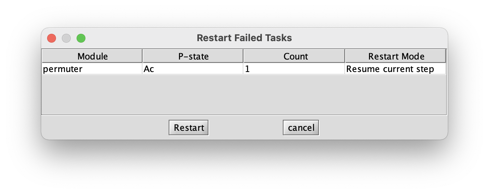

## Re-Run or Resume a Failed Task

Let's assume at this point that you've investigated the cause of your failed task. Maybe you've made software changes that address the problem, so now you want to re-run the failed task. Or maybe you've decided that it's not worth the effort to try to salvage the failed subtasks but you would like to capture the results of the successful ones. In either case, the restart dialog is what you need to use. 

### The Restart Dialog Box

To view the restart dialog box, select your failed task or tasks, right click, and select `Restart` from the tasks menu. You'll see this:

If you right-click on the `Restart Mode` field, you'll get a menu that offers several restart options. 

#### Restart from Beginning

This does pretty much what it sounds like. Go back, redo marshaling, then run the algorithm code, etc. It's pretty unlikely that you'll want to use this option unless you've made a change that will cause marshaling to retrieve different inputs, but it's there if you need to do that. 

If you restart a task from the beginning, this will also wipe out the information on which subtasks failed and which were successful, so Ziggy will have to re-run all the subtasks. 

#### Resubmit

This resumes execution immediately after marshaling, when Ziggy hands off execution to the algorithm management system. This is the option you'll want to use if you've made a code change that will address the problem.

Note that if you do this, only the failed subtasks will be run! All the subtasks that ran successfully will be left alone. If your code change was such that you want to go back and re-run those other subtasks as well, you'll need to launch a new pipeline instance or use the Restart from Beginning option. 

#### Resume Current Step

This tells Ziggy to try to pick up where it left off, in effect to force the P-state to advance and see what happens. 

Generally the case where you'd use this is the one we're in now: some subtasks ran, others didn't, the task made it to `ALGORITHM_COMPLETE` and then halted. Selecting this option will cause Ziggy to advance to `STORING`, at which point it will store the results from the 3 successful subtasks and abandon efforts to get results from the failed one. 

#### Resume Monitoring

In somewhat unusual cases, it may happen that the monitoring subsystem will lose track of what's going on with one or more tasks. In this case, you may see signs that execution is progressing, but the console doesn't show any updates. In this case, the `Resume Monitoring` option tells the monitoring subsystem to try to reconnect with the running task. 

### Restarting Multiple Tasks

If you have a bunch of tasks for a given node, it may be that some will fail while others don't, and you want to restart all the failed tasks. There are two ways to do this.

The first is to select all the failed tasks from the tasks menu (by shift-clicking or control-clicking), then right-click to get the tasks menu and select `Restart`. Note that this allows you to also restart a subset of failed tasks, which you might want to do. You can select the restart mode for each task you restart this way.

The other option, when you know that you want to restart all the failed tasks, is to select the instance from the instance table on the left, right-click to bring up the instances menu, and select the Restart all failed tasks menu item. In this case all tasks will use the same restart mode. 

### Note on Restarting the Failed Permuter Task

Remember how we started all this by ordering subtask 0 in each `permuter` task to fail? Here's an annoying subtlety: there's no way to get `permuter` to successfully run that subtask! 

Why not?

If the subtask had failed because of a real problem, we would be able to fix the problem and resubmit the task, or restart from the beginning. But what actually happened is that we set a module parameter that told `permuter` to throw an exception in subtask 0. 

If we re-run the task, it will re-run with the same values for all parameters (except for the remote execution parameters, but we're not using those at all for this example). This means that the `throw_exception_subtask_0 parameter` will still be true, and subtask 0 will fail again. 

In real life, it's possible that you'll encounter a situation like this one, in which a task fails and the only way to get it to run successfully is to change the values of some module parameters. In that case, you won't be able to re-run because re-run doesn't let you change the parameters. In that case, you'll need to change the parameters and use the triggers panel to start a new pipeline instance. In the more common cases (software bug that had to be fixed, failure due to some sort of hardware problem, etc.), re-running a task offers the possibility of getting failed subtasks to run to completion. 